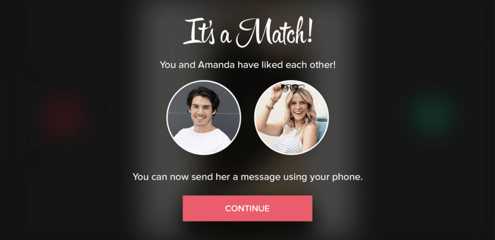

# Liminal Assessment Submission — Reciprocal Preference Pipeline

**Summary.** I used a Tinder-style swipe scenario (like=1, dislike=0) as a test of AI-assisted engineering: a modular train + eval pipeline for reciprocal preference scoring, built in parallel across six Cursor-driven modules. 

Matrix Factorization, MF, from [REF (Ramanathan et al., AAAI 2021)](https://cdn.aaai.org/ojs/17807/17807-13-21301-1-2-20210518.pdf) and Neural Collaborative Filtering, NCF, [He et al., 2017](https://arxiv.org/pdf/1708.05031) ship equations with no code. I implemented both and golden-tested save/load so eval scoring matches training. 

---



## 1. Choose and frame the problem

### 1.1 The problem

On Tinder app, user swipes right for like=1, and left for dislike=0. A match requires both users to like. Most feeds rank by engagement ("whom you like"), not mutual fit ("whom you like who would like you back"). This surfaces one-sided crushes and profile cycling.

**Challenge:** rank for mutual preference.

### 1.2 Why this is interesting to me

I wanted to work on a new domain and thought it'd be amusing to work on “Netflix for dating,” but social matching is inherently a negotiation (no producer–consumer split):

1. Attraction is asymmetric; one side often has more influence.
2. Preferences are malleable: users trade off quality against convenience (distance, effort).

---

## 2. Design the solution

I built a **modular offline train + eval pipeline for reciprocal preference scoring** and compared 2 preference models: [MF](https://cdn.aaai.org/ojs/17807/17807-13-21301-1-2-20210518.pdf) and [NCF](https://arxiv.org/pdf/1708.05031). Each model produces directional scores only; reciprocal fusion happens at ranking time.

**Out of scope:** swipe UI (would only re-sort `comparison.json` — answered offline via `policy_tradeoff.json` instead); modelling chemistry, logistics, transient intent.

### 2.1 Paper-to-code (no reference implementation)

Papers provide losses and architectures, but not the data ingestion + preprocessing, artifact formats, or model-agnostic evaluator.

| Layer | AI role | My role |
|-------|---------|---------|
| Literature review | Summarization | Adversarial prompts - e.g. “Do you recommend X or Y? What’s the strongest case against your recommendation?” |
| Libimseti dataset preprocessing | Implementation | Binarize (≥7 = like), per-user split, subgraph sampling; random per-user stratified train/val/test |
| MF / NCF mechanics | Implement equations  | Verify |
| Module boundaries, architecture | Implementation | Design so `eval/` never imports `models/` |
| Trust | TDD, import-linter guardrails | Verify |

### 2.2 AI workflow (Cursor Agent)

I wrote a **meta-prompt** [`prompts/0_initial_meta_prompt.md`](prompts/0_initial_meta_prompt.md) which plans all cursor sessions and corresponding prompts. Each module = 1 session with an init prompt in [`prompts/*_init.md`](prompts/). 

```
# Chat session execution order: 
Architecture → [Data, MF, NCF, Evaluation] (parallel) → Experiments
```

#### 2.2.1 Guardrails

- **Module boundaries.** This enables parallel sessions. [`.cursor/rules/`](.cursor/rules/) + `import-linter`: modules talk via `core/` types and `ModelArtifact` JSON only — four parallel sessions without import spaghetti.
- **Save/load golden tests.** Every model passes `verify_scorer_matches_directional` after serialization ([`tests/test_scoring_golden.py`](tests/test_scoring_golden.py)).
- **Code structure + TDD.** Cursor skills to maintain modularity and prevent logic duplication; tests first, never patch tests to fit bad impl.

---

## 3. Prove it (2 artifacts and a policy observation)

### 3.1 Modular pipeline (Load → train MF + NCF → evaluate → comparison table)

```bash
python3.11 -m venv .venv && source .venv/bin/activate
pip install -e ".[dev]"
pytest && python -m importlinter.cli && mypy && ruff check .

python -m experiments.cli --config experiments/configs/prototype.json
```

**Smoke test** (`ratings.local.dat`, ~120k rows, 10 distractors — not full Libimseti):

| Model | Aggregation | Recall@5 | HR@5 | NDCG@5 |
|-------|-------------|----------|------|--------|
| MF | product | 0.00 | 0.82 | 0.51 |
| MF | harmonic | 0.00 | 0.81 | 0.49 |
| NCF | product | 0.00 | 0.83 | 0.59 |
| NCF | harmonic | 0.00 | 0.83 | 0.59 |

Note that Recall@5 = 0 is expected; HR@5 inflated by tiny distractor pool; NCF NDCG edge is weak signal only.

### 3.2 Prompt system

| Artifact | Location |
|----------|----------|
| Meta-prompt | [`prompts/0_initial_meta_prompt.md`](prompts/0_initial_meta_prompt.md) |
| Per-module prompts | [`prompts/1_architecture.md`](prompts/1_architecture.md) … [`prompts/6_experiments_init.md`](prompts/6_experiments_init.md) |
| Checklist | [`prompts/README.md`](prompts/README.md) |

### 3.3 Policy insight — 2 ways to rank the feed

| Feed | Sort by | Meaning |
|------|---------|---------|
| Engagement | `s(u→v)` | Predicted strength of u liking v |
| Mutual | `r(u,v) = f(s(u→v), s(v→u))` | Predicted strength of mutual liking (harmonic / product) |

```bash
python -m experiments.cli --config experiments/configs/prototype.json --policy-analysis
```

For 670 users with a held-out mutual match, rank everyone else both ways and compare Recall@10 ([`eval/services/policy_comparison.py`](eval/services/policy_comparison.py)). Output: [`experiments/results/prototype/policy_tradeoff.json`](experiments/results/prototype/policy_tradeoff.json).

**Finding on test set:** 
Whenever the two feeds disagree on who should be **#1**, the engagement pick is **never** a real mutual match. 

**Why this matters:** If you ship engagement ranking, your top recommendation can systematically be someone who would not match back.

---

## 4. Analyze the impact

### 4.1 Before vs after

| | Without AI assistance | With this workflow |
|---|----------------------|-------------------|
| **Scope** | One model, ad-hoc scripts, eval coupled to training | Six modules, two models, model-agnostic eval — parallel Cursor sessions |
| **Trust** | "Tests pass" | Golden save/load + import-linter on artifact seam |
| **Product question** | Debate in a deck | `--policy-analysis` → `policy_tradeoff.json` |

**Tradeoff:** upfront architecture cost; integration and interpretation still sequential.

### 4.2 Where human judgment still mattered

- **Demo pressure on swipe UI** — Swipe UI makes look complete but adds 
no inference.
- **Honest reporting** — report #1 trap rate, not inflated HR@5.
The actionable signal is the #1 disagreement pattern, not HR@5 inflated 
by only 10 distractors.
- **Paper claims** — verify agent summaries against PDFs.

### 4.3 Taking this further

Two gaps:
- **Does the policy finding hold?** Full Libimseti benchmark; cold-start (Libimseti has no photos, bios, distance).
- **Does the workflow transfer?** Frozen `core/` contracts for parallel agents; [`prompts/`](prompts/) as handoff spec for the next engineer — not yet proven on another codebase.
